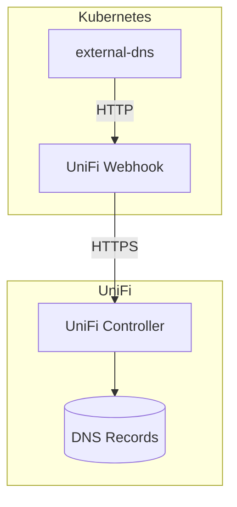
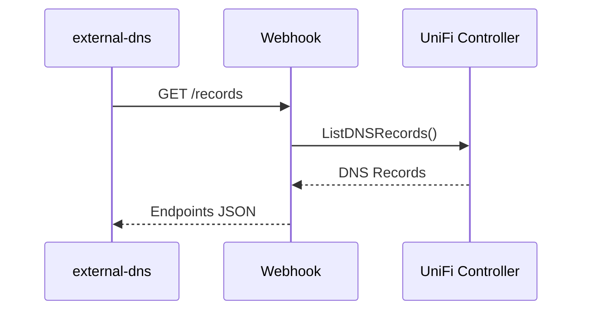
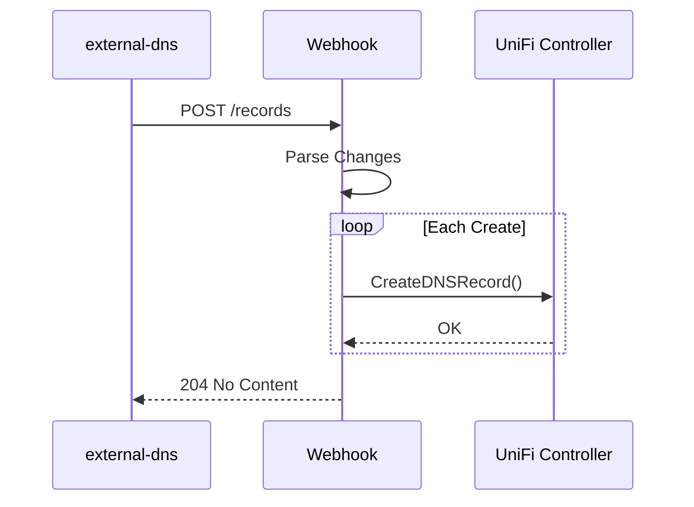

# Architecture

Overview of external-dns-unifios-webhook system design.

## Overview

The webhook acts as a bridge between external-dns and UniFi OS DNS management. It implements the external-dns webhook provider interface and translates DNS operations to UniFi API calls.



## Components

### Entry Point

**`cmd/webhook/main.go`**

- Application initialization
- Configuration loading
- Server startup
- Graceful shutdown handling

### Provider Layer

**`internal/provider/`**

The core DNS provider implementation:

- `provider.go` - Main provider implementing external-dns interface
- `interface.go` - Provider interface definition

Key methods:

| Method | Description |
|--------|-------------|
| `Records()` | List all DNS records |
| `ApplyChanges()` | Apply create/update/delete operations |
| `AdjustEndpoints()` | Adjust endpoints before processing |
| `GetDomainFilter()` | Return domain filter configuration |

### Configuration

**`internal/config/`**

Viper-based configuration management:

- Environment variable binding with `WEBHOOK_` prefix
- Validation of required parameters
- Default values

### HTTP Servers

**`internal/webhookserver/`**

Webhook API server (default: `localhost:8888`):

- OpenAPI-generated handlers
- Implements external-dns webhook protocol

**`internal/healthserver/`**

Health/metrics server (default: `0.0.0.0:8080`):

- `/healthz` - Liveness probe
- `/readyz` - Readiness probe
- `/metrics` - Prometheus metrics

### Observability

**`internal/observability/`**

Logging and metrics adapters:

- `slog_adapter.go` - Adapts slog to UniFi client logger
- `prometheus_recorder.go` - Prometheus metrics adapter

**`internal/metrics/`**

Custom Prometheus metrics:

- `external_dns_unifi_dns_records_managed`
- `external_dns_unifi_dns_operations_total`
- `external_dns_unifi_dns_operation_duration_seconds`
- `external_dns_unifi_dns_changes_applied`
- `external_dns_unifi_readiness_cache_hits_total`
- `external_dns_unifi_readiness_cache_misses_total`
- `external_dns_unifi_readiness_cache_age_seconds`

## Data Flow

### Record Listing



### Record Creation



## Performance Optimizations

### Parallel Operations

The provider uses a semaphore to limit concurrent API calls:

```go
sem := semaphore.NewWeighted(5) // Max 5 concurrent operations
```

### Record Index Caching

Before batch operations, the provider builds an in-memory index:

```go
index := p.buildRecordIndex()
```

This prevents N*API_calls problem during batch deletes.

## Record Type Mapping

| external-dns | UniFi API |
|--------------|-----------|
| A | A |
| AAAA | AAAA |
| CNAME | CNAME |
| TXT | TXT |

## Limitations

### UniFi/dnsmasq Constraints

- TXT records don't support TTL
- Wildcard CNAME not supported
- Duplicate CNAME records not supported

### Request Size

5MB request body limit (~25,000 DNS records).

## Error Handling

The provider uses `cockroachdb/errors` for error wrapping with stack traces:

```go
if err != nil {
    return errors.Wrap(err, "failed to create DNS record")
}
```

## Dependencies

| Package | Purpose |
|---------|---------|
| `github.com/lexfrei/go-unifi` | UniFi API client |
| `sigs.k8s.io/external-dns` | external-dns types |
| `net/http` | HTTP server (stdlib) |
| `github.com/prometheus/client_golang` | Prometheus metrics |
| `github.com/spf13/viper` | Configuration |
| `github.com/cockroachdb/errors` | Enhanced errors |
| `golang.org/x/sync/semaphore` | Concurrency limiting |
