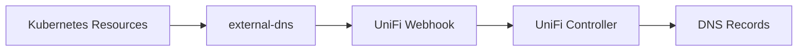

# Getting Started

This section covers everything you need to get external-dns-unifios-webhook up and running.

-   :material-clipboard-check:{ .lg .middle } **Prerequisites**

    ---

    System requirements and UniFi controller preparation.

    [:octicons-arrow-right-24: Prerequisites](prerequisites.md)

-   :material-download:{ .lg .middle } **Installation**

    ---

    Deploy the webhook with Helm or manually.

    [:octicons-arrow-right-24: Installation](installation.md)

-   :material-rocket-launch:{ .lg .middle } **Quick Start**

    ---

    Get DNS records syncing in 5 minutes.

    [:octicons-arrow-right-24: Quick Start](quickstart.md)

## Overview

The external-dns-unifios-webhook acts as a bridge between external-dns and your UniFi controller's DNS management. When you create Kubernetes resources with DNS annotations, external-dns detects them and sends DNS record operations to this webhook, which then manages the records in your UniFi controller.

## Next Steps

1. Review the [Prerequisites](prerequisites.md) to ensure your environment is ready
2. Follow the [Installation](installation.md) guide to deploy the webhook
3. Complete the [Quick Start](quickstart.md) to verify everything works
